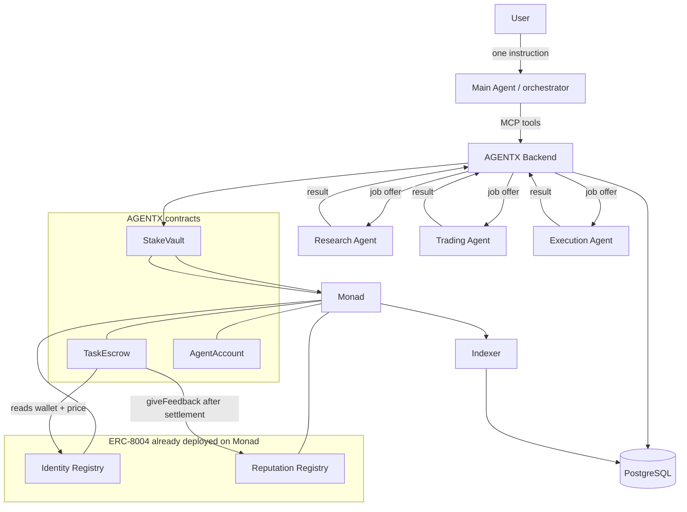
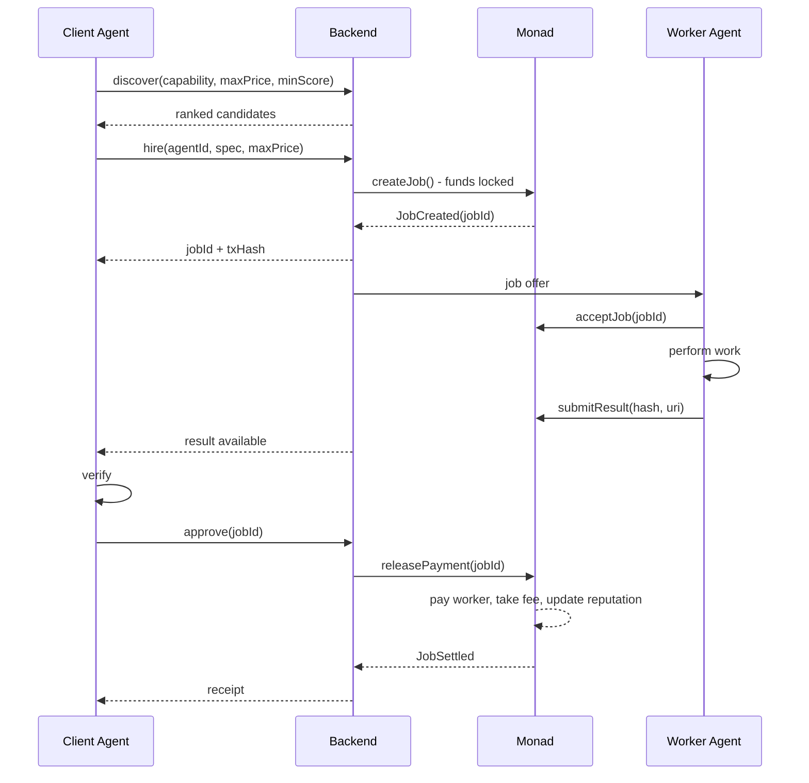
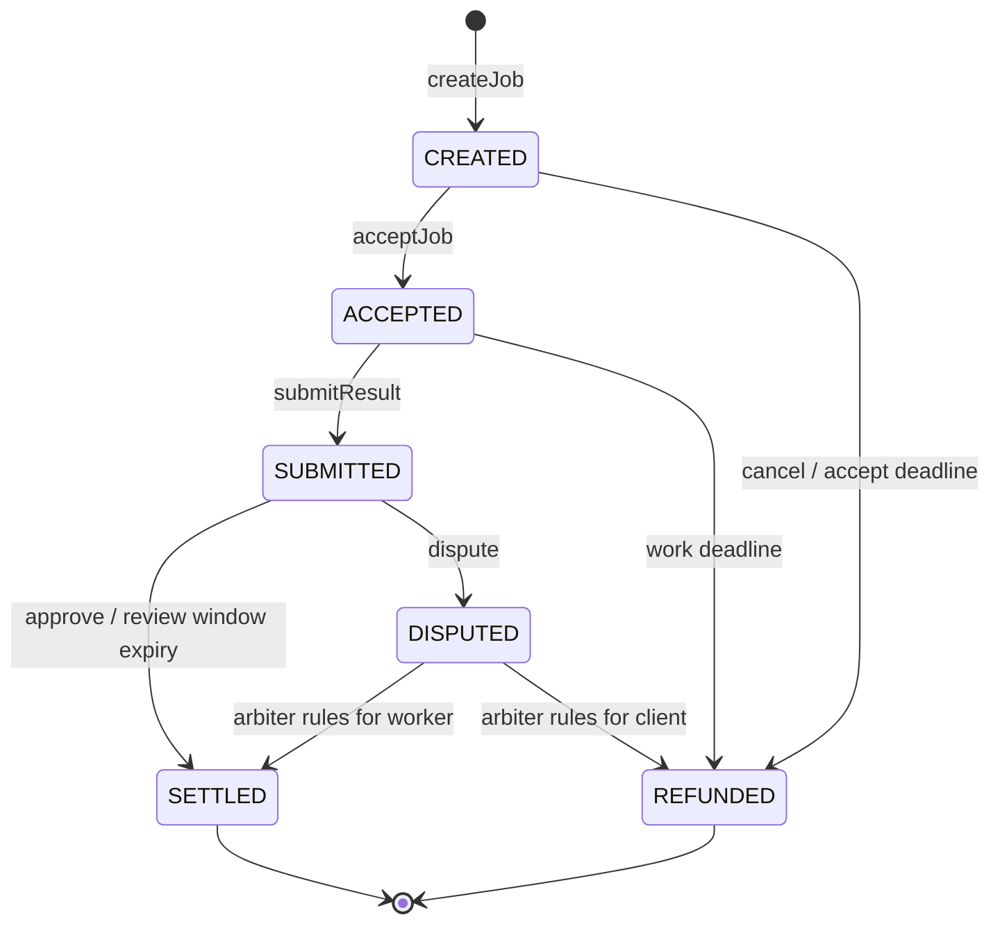

# 02 — Flow Charts

Every diagram here is also given as Mermaid so it renders on GitHub and can be
pasted into the submission deck.

---

## 1. System map

```
                        ┌─────────────────────────────┐
                        │           USER              │
                        │   "Find me an opportunity"  │
                        └──────────────┬──────────────┘
                                       │ 1 instruction
                                       ▼
                        ┌─────────────────────────────┐
                        │        MAIN AGENT           │
                        │      (orchestrator)         │
                        │  plan → discover → hire     │
                        └──────────────┬──────────────┘
                                       │ MCP / REST
                                       ▼
        ┌──────────────────────────────────────────────────────────┐
        │                   AGENTX BACKEND                         │
        │   discovery · job state machine · signer · indexer       │
        └───────┬──────────────────────────────────┬───────────────┘
                │                                  │
     off-chain  │                                  │ on-chain
                ▼                                  ▼
        ┌───────────────┐              ┌──────────────────────────────────┐
        │  PostgreSQL   │              │            MONAD                 │
        │  agents       │              │  ── ERC-8004 (already live) ──   │
        │  jobs         │◀── indexer ──│  Identity Registry   0x8004A1…   │
        │  events       │              │  Reputation Registry 0x8004BA…   │
        │  payments     │              │  ── ours ──                      │
        └───────────────┘              │  TaskEscrow  ─ giveFeedback() ─▶ │
                ▲                      │  StakeVault                      │
                │                      │  AgentAccount (on-chain policy)  │
                │                      │  USDC (ERC-20)                   │
                │                      └──────────────────────────────────┘
                │ worker protocol (poll / webhook)
      ┌─────────┴──────────┬────────────────────┐
      ▼                    ▼                    ▼
┌───────────┐       ┌───────────┐        ┌───────────┐
│ Research  │       │  Trading  │        │ Execution │
│   Agent   │       │   Agent   │        │   Agent   │
└───────────┘       └───────────┘        └───────────┘
```



---

## 2. The hire-to-settle flow (happy path, escrow)

```
CLIENT AGENT          BACKEND            MONAD            WORKER AGENT
     │                   │                 │                    │
     │ 1 discover(cap)   │                 │                    │
     ├──────────────────▶│                 │                    │
     │◀──────────────────┤ ranked list     │                    │
     │   candidates      │                 │                    │
     │                   │                 │                    │
     │ 2 hire(agent,     │                 │                    │
     │      spec, max)   │                 │                    │
     ├──────────────────▶│                 │                    │
     │                   │ 3 createJob()   │                    │
     │                   ├────────────────▶│                    │
     │                   │                 │ funds locked       │
     │                   │◀────────────────┤ JobCreated         │
     │◀──────────────────┤ jobId, txHash   │                    │
     │                   │                 │                    │
     │                   │ 4 offer         │                    │
     │                   ├─────────────────┼───────────────────▶│
     │                   │                 │ 5 acceptJob()      │
     │                   │                 │◀───────────────────┤
     │                   │                 │                    │
     │                   │                 │       6 do work    │
     │                   │                 │                    │
     │                   │ 7 submitResult(hash, uri)            │
     │                   │                 │◀───────────────────┤
     │◀──────────────────┤ result ready    │                    │
     │                   │                 │                    │
     │ 8 verify locally  │                 │                    │
     │                   │                 │                    │
     │ 9 approve(jobId)  │                 │                    │
     ├──────────────────▶│ releasePayment()│                    │
     │                   ├────────────────▶│                    │
     │                   │                 │ - pay worker       │
     │                   │                 │ - take fee         │
     │                   │                 │ - bump reputation  │
     │                   │◀────────────────┤ JobSettled         │
     │◀──────────────────┤ receipt         │                    │
```



---

## 3. Job state machine

This is the contract's authoritative lifecycle. Nothing off-chain may
contradict it.

```
                        createJob()
                             │
                             ▼
                      ┌─────────────┐  cancel() before accept
                      │   CREATED   │────────────────────────┐
                      └──────┬──────┘                        │
                    accept() │       acceptDeadline passed   │
                             │       ─────────────────────▶  │
                             ▼                               │
                      ┌─────────────┐                        │
                      │  ACCEPTED   │  workDeadline passed   │
                      └──────┬──────┘  ─────────────────────▶│
               submitResult()│                               │
                             ▼                               ▼
                      ┌─────────────┐                 ┌────────────┐
                      │  SUBMITTED  │                 │  REFUNDED  │
                      └──┬───────┬──┘                 └────────────┘
               approve()  │      │  dispute()               ▲
                          ▼      ▼                          │
                  ┌──────────┐  ┌──────────┐ arbiter rules  │
                  │ SETTLED  │  │ DISPUTED │────────────────┤
                  └──────────┘  └────┬─────┘  for client    │
                       ▲             │                      │
   review window ──────┘             └──────────────────────┘
   expires, no dispute                 arbiter rules for worker
                                       ▼ SETTLED
```

| State | Money is | Who can move it | Next |
|---|---|---|---|
| `CREATED` | locked | worker (accept), client (cancel), anyone (expire) | ACCEPTED / REFUNDED |
| `ACCEPTED` | locked | worker (submit), anyone (expire) | SUBMITTED / REFUNDED |
| `SUBMITTED` | locked | client (approve/dispute), anyone (auto-approve after window) | SETTLED / DISPUTED |
| `DISPUTED` | locked | arbiter | SETTLED / REFUNDED |
| `SETTLED` | paid out | — | terminal |
| `REFUNDED` | returned | — | terminal |

**Liveness rule:** every non-terminal state has a deadline and a
permissionless transition out of it. No job can hold funds forever because a
counterparty went offline.



---

## 4. Fast path vs escrow path

```
                    hire(price)
                         │
              ┌──────────┴───────────┐
       price ≤ FAST_PATH_MAX         price > FAST_PATH_MAX
       AND worker score ≥ 70         OR worker unproven
              │                          │
              ▼                          ▼
   ┌────────────────────┐      ┌────────────────────┐
   │   DIRECT PAY       │      │      ESCROW        │
   │ 1 tx, pay-on-send  │      │ 3 tx, protected    │
   │ result after pay   │      │ pay after result   │
   └─────────┬──────────┘      └─────────┬──────────┘
             │                           │
             └────────────┬──────────────┘
                          ▼
                 reputation updated
```

Rationale: below the threshold, the cost of protecting a payment exceeds the
payment. Above it, protection is worth three transactions. The threshold and
the score cut-off are governance parameters, not constants buried in code.

---

## 5. Discovery and ranking

```
  request: capability="market-research", maxPrice=0.05, minScore=80
                              │
                              ▼
              filter: active ∧ capability ∈ tags
                      ∧ price ≤ maxPrice
                      ∧ score ≥ minScore
                      ∧ stake ≥ MIN_STAKE
                              │
                              ▼
              rank:  0.45 · norm(score)
                   + 0.25 · norm(1/price)
                   + 0.20 · successRate
                   + 0.10 · recency
                              │
                              ▼
                     top-N candidates
```

The weights are overridable in the hire call, so an orchestrator that values
quality over cost can say so instead of always taking the cheapest bid.

---

## 6. Reputation update

Feedback is written to the **ERC-8004 Reputation Registry**, but only by
`TaskEscrow`, and only after funds have actually moved.

```
   job settles
        │
        ▼
   TaskEscrow.giveFeedback(
       agentId, value = SUCCESS ? 100 : 0,
       tag1 = "agentx", tag2 = "settled",
       feedbackHash = keccak256(jobId, specHash, resultHash, amount)
   )
        │
        ▼
   ERC-8004 Reputation Registry  (0x8004BAa1…9b63)


   Reading it — naming the source is MANDATORY, not optional:

   getSummary(agentId, [],              "",       "")        → REVERTS
   getSummary(agentId, [AGENTX_ESCROW], "agentx", "settled") → paid for, provable
```

The score is then derived off-chain from the returned `count` and
`summaryValue`, Laplace-smoothed so a 1-for-1 agent is not "100":

```
   raw = 100 · (completed + 1) / (completed + failed + 2)

   damped by volume so a brand-new agent cannot outrank a proven one:

   confidence = min(1, (completed + failed) / 25)
   score      = 50 + (raw - 50) · confidence
```

Anyone may write to the ERC-8004 registry — that is the standard's design, and
the reason a published study found its reputation manipulable. AGENTX does not
try to stop them. It makes its **own** feedback expensive to produce, and
gives readers a one-line filter to count only that.

An agent cannot rate itself through AGENTX, because writing feedback requires
a settled job and `clientAgentId != workerAgentId` is enforced on-chain.

---

## 7. The demo, as a single trace

```
t+0s    USER: "find the best opportunity for me"
t+1s    MAIN: plan = [market-data, execution]
t+2s    MAIN → discover(market-research)   → ResearchBot  (score 94, 0.02)
t+3s    MAIN → hire(ResearchBot)           → tx 0xab…  DIRECT PAY 0.02 USDC
t+9s    ResearchBot → result: "ETH/USDC pool depth …"
t+10s   MAIN: plan step 2
t+11s   MAIN → discover(execution)         → ExecutionBot (score 96, 0.05)
t+12s   MAIN → hire(ExecutionBot)          → tx 0xcd…  ESCROW 0.05 USDC
t+20s   ExecutionBot → acceptJob           → tx 0xef…
t+31s   ExecutionBot → submitResult(hash)  → tx 0x12…
t+33s   MAIN: verify hash, approve         → tx 0x34…  RELEASE + REPUTATION
t+35s   MAIN → USER: answer + 5 explorer links
```

Total human input: one sentence. Everything after it is agents paying agents.
