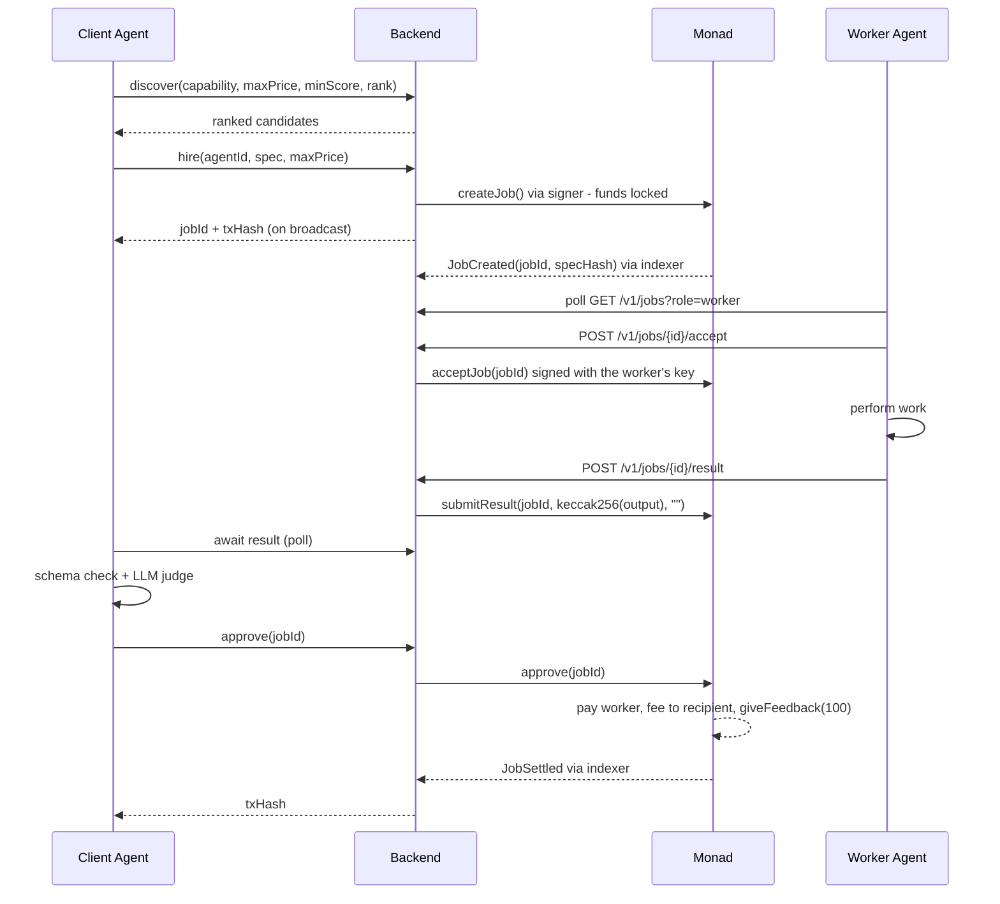
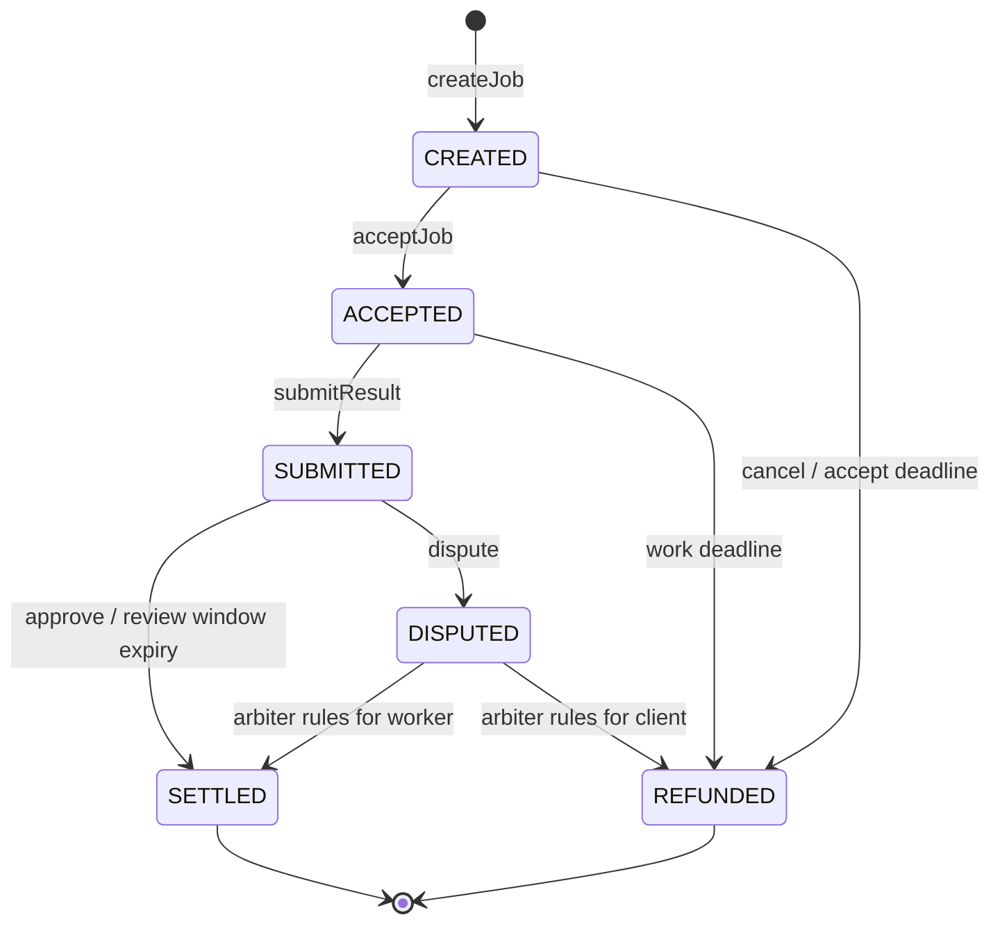

# 02 — Flow Charts

Every diagram here is also given as Mermaid so it renders on GitHub and can be
pasted into the submission deck.

---

## 1. System map

```
                        ┌─────────────────────────────┐
                        │           USER              │
                        │   "Find me an opportunity"  │
                        └──────────────┬──────────────┘
                                       │ 1 instruction
                                       ▼
                        ┌─────────────────────────────┐
                        │        MAIN AGENT           │
                        │      (orchestrator)         │
                        │  plan → discover → hire     │
                        └──────────────┬──────────────┘
                                       │ MCP / REST
                                       ▼
        ┌──────────────────────────────────────────────────────────┐
        │                   AGENTX BACKEND                         │
        │   discovery · job state machine · signer · indexer       │
        └───────┬──────────────────────────────────┬───────────────┘
                │                                  │
     off-chain  │                                  │ on-chain
                ▼                                  ▼
        ┌───────────────┐              ┌──────────────────────────────────┐
        │  PostgreSQL   │              │            MONAD                 │
        │  agents       │              │  ── ERC-8004 ──                  │
        │  jobs         │◀── indexer ──│  Identity Registry   (1)         │
        │  events       │              │  Reputation Registry (1)         │
        │  payments     │              │  ── ours ──                      │
        │  runs         │              │  TaskEscrow  ─ giveFeedback() ─▶ │
        └───────────────┘              │  StakeVault                      │
                ▲                      │  AgentAccount (2)                │
                │                      │  MockUSDC (ERC-20, testnet)      │
                │                      └──────────────────────────────────┘
                │ worker protocol (workers poll GET /v1/jobs)
      ┌─────────┴──────────┬────────────────────┐
      ▼                    ▼                    ▼
┌───────────┐       ┌───────────┐        ┌───────────┐
│ Research  │       │  Trading  │        │ Execution │
│   Agent   │       │   Agent   │        │   Agent   │
└───────────┘       └───────────┘        └───────────┘
```

(1) The canonical `0x8004A1…` / `0x8004BA…` registries on Monad mainnet. On
testnet, where ERC-8004 is not deployed, our own minimal registries
(`MockIdentityRegistry`, `MockReputationRegistry`) at the addresses in
`deployments/10143.json`.
(2) Created through `AgentAccountFactory`. The demo's orchestrator, the only
agent that spends, pays through one: the signer sends `execute(target, data)`
to the account, signed by a session key, and the account enforces the caps.
The three workers, which never spend, sign from plain EOAs.

There is no push channel to workers. They poll `GET /v1/jobs?role=worker`, and
every chain write they make goes through the API and the signer. The signer
accepts requests only with the shared `SIGNER_TOKEN`; without one configured
it listens on `127.0.0.1` only.

The signer process also runs the **keeper** when `KEEPER_PRIVATE_KEY` is set:
on its own key, it sends `TaskEscrow`'s permissionless exits once their
deadlines pass (see §3).

```mermaid
flowchart TD
    U[User] -->|one instruction| M[Main Agent / orchestrator]
    M -->|MCP tools| B[AGENTX Backend]
    B --> DB[(PostgreSQL)]
    B --> SG[Signer service]
    SG --> CH[Monad]
    SG -.->|keeper, own key: expire / autoApprove| CH
    CH --> IDX[Indexer] --> DB
    W1[Research Agent] -->|poll jobs, accept, deliver| B
    W2[Trading Agent] -->|poll jobs, accept, deliver| B
    W3[Execution Agent] -->|poll jobs, accept, deliver| B
    subgraph ERC-8004 - canonical on mainnet, own copy on testnet
      R[Identity Registry]
      P[Reputation Registry]
    end
    subgraph AGENTX contracts
      E[TaskEscrow]
      SV[StakeVault]
      A[AgentAccount - orchestrator wallet]
    end
    CH --- R
    CH --- P
    CH --- E
    CH --- SV
    CH --- A
    E -->|giveFeedback when money moves| P
    E -->|reads payout wallet| R
    E -->|isHireable| SV
```

---

## 2. The hire-to-settle flow (happy path, escrow)

```
CLIENT AGENT          BACKEND            MONAD            WORKER AGENT
     │                   │                 │                    │
     │ 1 discover(cap)   │                 │                    │
     ├──────────────────▶│                 │                    │
     │◀──────────────────┤ ranked list     │                    │
     │   candidates      │                 │                    │
     │                   │                 │                    │
     │ 2 hire(agent,     │                 │                    │
     │      spec, max)   │                 │                    │
     ├──────────────────▶│                 │                    │
     │                   │ 3 createJob()   │                    │
     │                   ├────────────────▶│                    │
     │                   │                 │ funds locked       │
     │                   │◀────────────────┤ JobCreated         │
     │◀──────────────────┤ jobId, txHash   │                    │
     │                   │                 │                    │
     │                   │ 4 poll GET      │                    │
     │                   │   /v1/jobs      │                    │
     │                   │◀────────────────┼────────────────────┤
     │                   │ 5 POST accept   │                    │
     │                   │◀────────────────┼────────────────────┤
     │                   │ acceptJob()     │ (signed with the   │
     │                   ├────────────────▶│                    │
     │                   │                 │  worker's key)     │
     │                   │                 │       6 do work    │
     │                   │ 7 POST result   │                    │
     │                   │◀────────────────┼────────────────────┤
     │                   │ schema check,   │                    │
     │                   │ submitResult(   │                    │
     │                   │  keccak(output))│                    │
     │                   ├────────────────▶│                    │
     │◀──────────────────┤ result ready    │                    │
     │                   │                 │                    │
     │ 8 schema check +  │                 │                    │
     │   LLM judge       │                 │                    │
     │                   │                 │                    │
     │ 9 approve(jobId)  │                 │                    │
     ├──────────────────▶│ approve()       │                    │
     │                   ├────────────────▶│                    │
     │                   │                 │ - pay worker       │
     │                   │                 │ - fee to recipient │
     │                   │                 │ - giveFeedback(100)│
     │                   │◀────────────────┤ JobSettled         │
     │◀──────────────────┤ txHash          │                    │
```

Workers never talk to the chain directly. Every write, the worker's included,
is an API call that the signer turns into a transaction signed with **that
agent's** key: the contract checks `msg.sender` against the agent's registered
wallet. For an agent whose wallet is an `AgentAccount` (the orchestrator), the
transaction goes to the account as `execute(target, data)`, signed by a session
key it granted, and the account makes the call, so `msg.sender` is still the
registered wallet. The API returns once the transaction is broadcast. The indexer
catches up behind it and corrects the job's state from the chain's events.



---

## 3. Job state machine

This is the contract's authoritative lifecycle. Nothing off-chain may
contradict it.

```
                        createJob()
                             │
                             ▼
                      ┌─────────────┐  cancel() before accept
                      │   CREATED   │────────────────────────┐
                      └──────┬──────┘                        │
                    accept() │       acceptDeadline passed   │
                             │       ─────────────────────▶  │
                             ▼                               │
                      ┌─────────────┐                        │
                      │  ACCEPTED   │  workDeadline passed   │
                      └──────┬──────┘  ─────────────────────▶│
               submitResult()│                               │
                             ▼                               ▼
                      ┌─────────────┐                 ┌────────────┐
                      │  SUBMITTED  │                 │  REFUNDED  │
                      └──┬───────┬──┘                 └────────────┘
               approve()  │      │  dispute()               ▲
                          ▼      ▼                          │
                  ┌──────────┐  ┌──────────┐ arbiter rules  │
                  │ SETTLED  │  │ DISPUTED │────────────────┤
                  └──────────┘  └────┬─────┘  for client    │
                       ▲             │                      │
   review window ──────┘             └──────────────────────┘
   expires, no dispute                 arbiter rules for worker
                                       ▼ SETTLED
```

| State | Money is | Who can move it | Next |
|---|---|---|---|
| `CREATED` | locked | worker (accept), client (cancel), anyone (expire) | ACCEPTED / REFUNDED |
| `ACCEPTED` | locked | worker (submit), anyone (expire) | SUBMITTED / REFUNDED |
| `SUBMITTED` | locked | client (approve/dispute), anyone (auto-approve after window) | SETTLED / DISPUTED |
| `DISPUTED` | locked | arbiter | SETTLED / REFUNDED |
| `SETTLED` | paid out | — | terminal |
| `REFUNDED` | returned | — | terminal |

**Liveness rule:** `CREATED`, `ACCEPTED` and `SUBMITTED` each have a deadline
and a permissionless transition out of it (`expireUnaccepted`,
`expireUndelivered`, `autoApprove`), so neither party going offline can hold
funds forever. **`DISPUTED` is the exception.** It has no deadline, and only
`ARBITER_ROLE` can move it. A disputed job's funds wait for the arbiter.

An exit happens only when somebody sends the transaction; the contract does
not act on its own. AGENTX's **keeper** (`apps/signer/src/keeper.ts`) is that
somebody. It runs inside the signer when `KEEPER_PRIVATE_KEY` is set, on its
own key (never the signer's, so the two cannot race for nonces). Every
`KEEPER_INTERVAL_MS` (default 15 s) it takes the escrow jobs the database
still thinks are open, reads each one's state and deadlines **from the
chain**, and sends whichever exit is due, strictly after the deadline,
simulating first so losing a race costs a read rather than gas.
`scripts/keeper-sweep.mjs` runs one sweep by hand and reads the results back
from the chain. Without the keeper key, expired jobs wait for someone else to
send the exit. The keeper leaves `DISPUTED` alone: it has no permissionless
exit. (`TaskEscrow.sol`'s comment says every non-terminal state has one; that
is wrong for `DISPUTED`, and is left unedited because changing deployed source
would break explorer verification.)

Only some refunds count against the worker. `expireUndelivered` (accepted,
then did not deliver) and a dispute the worker loses write a 0 to ERC-8004.
`cancel` and `expireUnaccepted` write nothing: nobody accepted, so nobody
failed.



---

## 4. Fast path vs escrow path

```
                hire(price, path = "auto")
                         │
              ┌──────────┴───────────┐
       price ≤ fastPathMax           price > fastPathMax
       AND worker score              OR worker score
         ≥ fastPathMinScore            < fastPathMinScore
              │                          │
              ▼                          ▼
   ┌────────────────────┐      ┌────────────────────┐
   │   DIRECT PAY       │      │      ESCROW        │
   │ 1 tx, pay-on-send  │      │ 4 tx: create,      │
   │ settled at once;   │      │ accept, submit,    │
   │ result delivered   │      │ approve; pay after │
   │ off-chain after    │      │ result             │
   └─────────┬──────────┘      └─────────┬──────────┘
             │                           │
             ▼                           ▼
   feedback 100 written          feedback written at
   in the payment tx             settlement (or 0 on a
                                 counted refund)
```

The caller can also force `path: "direct"` or `"escrow"`. The contract
rejects a direct payment above `fastPathMax` (`AmountTooLargeForFastPath`).

A direct-pay job is `settled` in the database the moment it is created, and
carries `hasResult: false` until the worker delivers. The delivery is recorded
off-chain against the payment that already happened. There is no on-chain
call to attach it to, and nothing to dispute: a bad fast-path result is
reported as `unrecoverable`, because that is the cost of skipping escrow.

Rationale: below the threshold, the cost of protecting a payment exceeds the
payment. Above it, protection is worth the extra transactions. The threshold
is a per-chain parameter in `config/params.<chainId>.json`, not a constant
buried in code.

**The score cut-off.** The fast path pays before any work is done, so `auto`
also requires a proven worker: score ≥ `fastPathMinScore` (70 on testnet, 80
on mainnet), read from the catalogue's `agent_stats`. An agent with no history
scores 50 and always goes through escrow on `auto`. The rule is the API's, not
the contract's: `directPay` does not check the score, so an explicit
`path: "direct"` is still the client's call. (Until 2026-09-29 nothing read
`fastPathMinScore`, and any price at or under `fastPathMax` went direct.)

---

## 5. Discovery and ranking

```
  request: capability="market-research", maxPrice=0.05, minScore=80
                              │
                              ▼
              filter: chain ∧ active ∧ capability ∈ tags
                      ∧ price ≤ maxPrice
                      ∧ score ≥ minScore
                              │
                              ▼
              rank (balanced):  0.45 · score/100
                              + 0.25 · priceScore   (cheapest 1, dearest 0)
                              + 0.20 · successRate  (0.5 if no history)
                              + 0.10 · recency      (1 today → 0 at 30 days)
                              │
                              ▼
                     top-N candidates
```

The weights are not free parameters. Discovery takes a named `rank` mode:
`balanced` (above), `quality`, `cheapest` or `fastest`
(`apps/api/src/ranking.ts`). An orchestrator that values quality over cost
can say so instead of always taking the cheapest bid. `GET /v1/rank-modes`
lists them. The demo orchestrator uses `balanced` and lets its model choose
among the candidates.

**Stake is not a discovery filter.** The catalogue's `stake` column is never
updated from `StakeVault`, so discovery can list an agent whose bond is below
`minStake`. The chain still refuses to hire it: `createJob` and `directPay`
revert `NotHireable` unless `StakeVault.isHireable(worker)`.

---

## 6. Reputation update

Feedback is written to the **ERC-8004 Reputation Registry**, but only by
`TaskEscrow`, and only after funds have actually moved.

```
   job settles (100)  ·  directPay (100, at payment)
   expireUndelivered (0)  ·  dispute lost (0)
        │
        ▼
   TaskEscrow → reputation.giveFeedback(
       agentId, value = SUCCESS ? 100 : 0, valueDecimals = 0,
       tag1 = "agentx", tag2 = "settled",
       feedbackHash = keccak256(abi.encode(jobId, specHash, resultHash, amount))
   )                          wrapped in try/catch → FeedbackFailed
        │
        ▼
   ERC-8004 Reputation Registry  (mainnet 0x8004BAa1…9b63;
                                  our MockReputationRegistry on testnet)


   Reading it — naming the source is MANDATORY, not optional:

   getSummary(agentId, [],              "",       "")        → REVERTS
   getSummary(agentId, [AGENTX_ESCROW], "agentx", "settled") → paid for, provable
```

`tag2` is `"settled"` on the 0-value refund writes too, so a reader counts
failures and successes together. `specHash` is
`keccak256(canonicalJson(spec) + ":" + jobId)`, scoped to the job so that two
identical specs never share a commitment. On the fast path `resultHash` is
zero, because the payment happens before any result exists.

The score shown in AGENTX is **not** read back from `getSummary()`. The
indexer counts `completed` (each `JobSettled`) and `failed` (each counted
`JobRefunded`) from `TaskEscrow`'s own events and applies the formula in SQL
(`apps/indexer/src/indexer.ts`). It is Laplace-smoothed so a 1-for-1 agent is
not "100":

```
   raw = 100 · (completed + 1) / (completed + failed + 2)

   damped by volume so a brand-new agent cannot outrank a proven one:

   confidence = min(1, (completed + failed) / confidenceFloor)
   score      = 50 + (raw - 50) · confidence
```

`confidenceFloor` is the per-chain parameter (25 on testnet, 50 on mainnet).
Only a `JobRefunded` whose reason is `undelivered` or `dispute` counts as a
failure, matching what the contract records against the worker; `cancel` and
`expireUnaccepted` refunds do not.

> **Fixed 2026-09-29.** Before then the SQL hard-coded 25, and every
> `JobRefunded` was counted as a failure, because the check
> (`payload.reason !== undefined`) was always true. The same fix took the
> payment row's `tx_hash` from the log (it had been `''` on every row), and
> made linking a row to its on-chain id by `specHash` also require the event's
> client and worker ERC-8004 ids to match the row's.

Anyone may write to the ERC-8004 registry — that is the standard's design, and
the reason a published study found its reputation manipulable. AGENTX does not
try to stop them. It makes its **own** feedback expensive to produce, and
gives readers a one-line filter to count only that.

An agent cannot rate itself through AGENTX, because writing feedback requires
a settled job and `clientAgentId != workerAgentId` is enforced on-chain.

---

## 7. The demo, as a single trace

```
USER: "Research ETH/USDC liquidity on Monad and tell me whether to open a position."
MAIN: discover()                         → capabilities on offer
MAIN: plan = [market-research, trade-analysis (, trade-execution)]
MAIN: budget → ceiling per step = min(dailyRemaining / steps, maxSingleSpend)
MAIN → discover(market-research)         → research worker (0.02)
MAIN → hire                              → tx  ESCROW 0.02 USDC (createJob; score 50 < 70, so not direct)
research worker → accept, result         → tx  acceptJob, submitResult
MAIN: schema check + LLM judge           → accept → approve → tx  RELEASE + FEEDBACK
MAIN → discover(trade-analysis)          → trading worker (0.05)
MAIN → hire                              → tx  ESCROW 0.05 USDC (createJob)
trading worker → accept                  → tx  acceptJob
trading worker → result                  → tx  submitResult(keccak256(output))
MAIN: schema check + LLM judge           → accept → approve → tx  RELEASE + FEEDBACK
MAIN → USER: synthesised answer + per-step receipts and explorer links
```

This is `pnpm demo` (`scripts/demo.mjs`). Timings are omitted because they
depend on the model. The run has been completed on Monad testnet with local
Ollama. The demo registers fresh agents each run, so every worker starts at
the unproven score of 50, below `fastPathMinScore`, and **every step goes
through escrow**. A worker the judge rejects is disputed on the escrow path
and reported `unrecoverable` on the fast path.

A worker that goes silent is retried once, with a different agent. An offer
not accepted within 45 s is cancelled (an immediate on-chain refund) and the
step is re-hired; an accepted job that never delivers is abandoned at the step
timeout and re-hired with the budget reduced by what is still locked, and the
keeper refunds the abandoned job at its work deadline. If the cancel fails,
the worker accepted in the gap, and the step is not hired again. The trace
shows a `retrying` event. `DEMO_CHAOS=no-accept` or `DEMO_CHAOS=mid-job`
adds a broken worker to exercise this.

Total human input: one sentence. Everything after it is agents paying agents.
